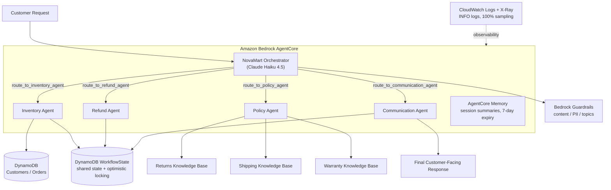

# Multi-Agent Customer Service System — NovaMart

An AWS Bedrock AgentCore multi-agent customer service system built with the [Strands Agents SDK](https://strandsagents.com/). NovaMart routes customer requests through an orchestrator agent that delegates to four specialist worker agents — inventory, policy, refund, and communication — backed by DynamoDB, three Amazon Bedrock Knowledge Bases, Bedrock Guardrails, AgentCore Runtime, AgentCore Memory, CloudWatch, and X-Ray.

This repository contains the completed capstone project for Udacity's Agentic AI course, alongside the course lesson folders it was developed from.

**Official project test result: 120/120 pts (100%).**

---

## Key Features

- **Multi-agent orchestration** — an orchestrator agent (Claude Haiku 4.5) routes every request to the correct specialist agent using five tool-based routing functions and six explicit routing rules.
- **Specialized worker agents** — inventory, policy, refund, and communication agents (Claude Sonnet 4.5) each own a narrow responsibility and expose tools for the orchestrator to call.
- **Multi-Agent RAG** — the Policy Agent fans out to three retriever sub-agents in parallel with `ThreadPoolExecutor`, then synthesizes the retrieved passages into one policy answer.
- **Three Amazon Bedrock Knowledge Bases** — returns, shipping, and warranty policy corpora, each backed by an S3 Vectors index.
- **DynamoDB shared workflow state** — every agent step writes to a `WorkflowState` item with optimistic locking (versioned conditional updates).
- **Amazon Bedrock Guardrails** — content filters, PII handling (block/anonymize), denied topics, and profanity filtering, applied to every model invocation.
- **AgentCore Runtime deployment** — the agent graph is packaged and deployed as a managed AgentCore Runtime (HTTP, public network) through the AgentCore CLI.
- **AgentCore Memory** — session-summary memory strategy with 7-day event expiry for cross-turn conversational context.
- **CloudWatch logging** — agent logs shipped at INFO level to a dedicated log group, locally and from the deployed runtime.
- **X-Ray tracing** — 100% sampling with CloudWatch Transaction Search, showing the orchestrator → worker → knowledge-base call chain.

---

## Architecture



Request flow in short:

```
Customer Request
      ↓
NovaMart Orchestrator
      ↓
┌─────────────┬─────────────┬─────────────┬──────────────────────┐
│ Inventory   │ Policy      │ Refund      │ Communication        │
│ Agent       │ Agent       │ Agent       │ Agent                │
└──────┬──────┴──────┬──────┴──────┬──────┴──────────┬───────────┘
       │             ↓             │                 │
       │   ┌─────────┼─────────┐   │                 │
       │   │ Returns │ Shipping│ Warranty           │
       │   │   KB    │   KB    │  KB                │
       │   └─────────┴─────────┘                     │
       ↓                                             ↓
 DynamoDB (orders/customers)          DynamoDB WorkflowState → Final response
```

Static architecture diagrams are also available in [`project/starter/diagrams/`](project/starter/diagrams/).

---

## Agent Responsibilities

| Agent | Model | Role |
|---|---|---|
| **Orchestrator** | Claude Haiku 4.5 (temperature 0.0) | Entry point. Initializes the session, classifies the request, routes to the correct worker agents in order, and always ends by routing to the Communication Agent. Never writes the final reply itself. Tools: `initialize_session`, `route_to_inventory_agent`, `route_to_policy_agent`, `route_to_refund_agent`, `route_to_communication_agent`. |
| **Inventory** | Claude Sonnet 4.5 (temperature 0.1) | Reads customer and order facts from DynamoDB. Tools: `check_order_status`, `get_customer_tier`, `list_customer_orders`. |
| **Policy** | Claude Sonnet 4.5 (temperature 0.1) | Answers policy questions by querying the three Knowledge Bases in parallel and synthesizing one grounded answer. Tool: `search_all_policies`. |
| **Refund** | Claude Sonnet 4.5 (temperature 0.1) | Evaluates return eligibility from the workflow state and initiates refunds within tier-based windows (30/60 days). Tools: `get_inventory_context`, `initiate_refund`. |
| **Communication** | Claude Sonnet 4.5 (temperature 0.3) | Composes the final customer-facing response from the complete workflow state. Tool: `get_full_workflow_context`. |

Shared state lives in a DynamoDB `WorkflowState` table keyed by session ID. Each agent writes its output to its own column using optimistic locking (`version` + conditional update), so concurrent or repeated runs cannot clobber each other. The terminal trace UI shows each step as it happens.

---

## Multi-Agent RAG

The Policy Agent implements retrieval-augmented generation across **three Amazon Bedrock Knowledge Bases**, each covering one policy corpus:

| Knowledge Base | Content | S3 prefix |
|---|---|---|
| **Returns Knowledge Base** | Return windows, conditions, refund rules | `policies/returns/` |
| **Shipping Knowledge Base** | Delivery times, rates, carriers | `policies/shipping/` |
| **Warranty Knowledge Base** | Warranty coverage and claim procedures | `policies/warranty/` |

- **Parallel retrieval** — `src/bedrock_kb_retrieval.py` spawns three retriever sub-agents concurrently via `ThreadPoolExecutor` (returns, shipping, warranty) instead of querying sequentially.
- **Synthesis** — retrieved passages from all three sub-agents are combined and passed to the Policy Agent's model, which produces a single grounded answer citing the actual policy text rather than the model's prior knowledge.

All three Knowledge Bases use `amazon.titan-embed-text-v2:0` embeddings over an S3 Vectors store.

---

## AWS Services Used

| Service | Purpose |
|---|---|
| Amazon Bedrock (Claude Haiku 4.5 / Sonnet 4.5) | Orchestrator and worker agent models |
| Amazon Bedrock Knowledge Bases | RAG over returns, shipping, and warranty policies |
| S3 Vectors | Vector store backing the three Knowledge Bases |
| Amazon S3 | Policy document corpus and deployment artifacts |
| Amazon DynamoDB | Customers, orders, and shared `WorkflowState` (optimistic locking) |
| Amazon Bedrock Guardrails | Content filtering, PII blocking/anonymization, denied topics, profanity |
| Amazon Bedrock AgentCore Runtime | Managed runtime hosting the deployed agent graph |
| Amazon Bedrock AgentCore Memory | Session-summary memory with 7-day event expiry |
| Amazon CloudWatch Logs | INFO-level agent logging (local and deployed) |
| AWS X-Ray | Distributed tracing at 100% sampling with Transaction Search |
| AWS IAM | AgentCore execution role and service permissions |
| AWS CloudFormation | Infrastructure stack (tables, buckets, roles, log group) |

---

## Project Structure

The repository root contains the course lesson folders (`lesson-01-…` through `lesson-11-…`) plus the capstone project:

```
project/starter/
├── src/
│   ├── agent_orchestrator.py    # Main module: agent builders (Task 2), guardrail (3),
│   │                            #   deployment (3), memory (4), observability (6),
│   │                            #   and CLI commands (test / chat / deploy / invoke / serve)
│   ├── agent_utils.py           # WorkflowState helpers (read/create/update with locking) + trace UI
│   ├── agent_observability.py   # X-Ray tracing + CloudWatch logging layer
│   ├── bedrock_kb_retrieval.py  # Parallel multi-agent RAG (3 retriever sub-agents)
│   ├── agentcore_cli.py         # Wrapper around the AgentCore CLI deployment pipeline
│   └── demo.py                  # Standalone demo entry point
├── tests/
│   └── test_agent.py            # Official project test suite (120 points)
├── infrastructure/
│   ├── starter_stack.yaml       # CloudFormation stack (DynamoDB, S3, S3 Vectors, IAM, logs)
│   ├── seed_data.py             # Seeds customers, orders, and policy documents
│   └── cleanup.py               # Tears down all created AWS resources
├── agentcore/
│   └── agentcore.json           # AgentCore CLI runtime definition (env vars, role, network)
├── diagrams/                    # Architecture diagrams (PNG)
├── config.py                    # Configuration: CloudFormation exports + .env
├── .env.example                 # Environment template (placeholders only)
├── requirements.txt             # Python dependencies
└── README.md                    # Detailed project implementation guide
```

---

## Configuration

All user-specific configuration lives in `project/starter/.env`, which is **git-ignored**. Start from the committed template:

```bash
cp .env.example .env        # Windows: copy .env.example .env
```

`.env.example` documents the expected keys with placeholder values only:

| Variable | Purpose |
|---|---|
| `AWS_REGION` | Deployment region (project uses `us-east-1`) |
| `RETURNS_KB_ID`, `SHIPPING_KB_ID`, `WARRANTY_KB_ID` | Knowledge Base IDs created in the AWS Console |
| `AGENTCORE_RUNTIME_ARN` | Populated by the deploy command |
| `GUARDRAIL_ID`, `GUARDRAIL_VERSION` | Populated by the deploy command (numbered version, not `DRAFT`) |

Most AWS resource names (DynamoDB tables, S3 buckets, IAM role ARN, log group) are resolved automatically from CloudFormation exports — no `.env` entries are needed for them. Real values are never committed to this repository.

---

## Installation / Setup

### Prerequisites

- Python 3.12+
- AWS credentials with permissions for Bedrock, DynamoDB, S3, AgentCore, CloudWatch, X-Ray, and IAM (via environment variables, shared credentials profile, SSO, or an instance role)
- For deployment only: Node.js 20+, `npm install -g @aws/agentcore@0.30.0`, and [`uv`](https://docs.astral.sh/uv/)
- A deployed `infrastructure/starter_stack.yaml` stack (run `python infrastructure/seed_data.py` to seed data)

### Steps

```bash
git clone https://github.com/frazcodes/multi-agent-ecommerce-rag.git
cd multi-agent-ecommerce-rag/project/starter

python -m venv .venv
# Windows
.venv\Scripts\activate
# macOS / Linux
source .venv/bin/activate

pip install -r requirements.txt

cp .env.example .env        # then fill in your KB IDs
```

Useful commands:

```bash
python config.py                                  # print resolved configuration
python src/agent_orchestrator.py test             # run the traced local test scenarios
python src/agent_orchestrator.py chat             # interactive terminal chat
python src/agent_orchestrator.py deploy           # deploy guardrail, runtime, memory, observability
python src/agent_orchestrator.py invoke "..."     # call the deployed AgentCore Runtime
```

---

## Testing

```bash
python tests/test_agent.py
```

The completed implementation passed all official project tests: **120/120 pts (100%)**.

| Test area | Points |
|---|---|
| Task 2 — Multi-agent graph (5 agents, tools, models) | 40 |
| Task 3 — Guardrails + AgentCore Runtime | 20 |
| Task 4 — AgentCore Memory | 15 |
| Task 5 — Knowledge Bases / Multi-Agent RAG | 25 |
| Task 6 — CloudWatch + X-Ray observability | 20 |
| **Total** | **120** |

Individual suites can be run with `python tests/test_agent.py task2` (likewise `task3` … `task6`). Tests read real state from AWS, so credentials must be configured.

For a live demonstration with tracing:

```bash
python src/agent_orchestrator.py test
```

---

## Observability

- **CloudWatch Logs** — every agent run (local `test`/`chat` and the deployed runtime) ships INFO-level logs to the project log group (`/aws/bedrock/agentcore/<project>`). The runtime carries `AGENT_LOG_GROUP`, `AGENT_LOG_LEVEL=INFO`, and `AGENT_LOG_TO_CLOUDWATCH=true` as environment variables.
- **AWS X-Ray** — each request is recorded as one trace at 100% sampling, with CloudWatch Transaction Search enabled (destination: CloudWatch Logs, 100% indexing). The trace shows the `NovaMart-Orchestrator` service calling each worker agent node, plus `KnowledgeBase:*` nodes for policy retrievals.

Traces are generated by running:

```bash
python src/agent_orchestrator.py test
```

Allow 30–60 seconds, then open **CloudWatch → X-Ray traces → Service map** to see the orchestrator → worker-agent call chain.

---

## Example Workflow

**"I want to return order ORD-1005."**

1. **Orchestrator** calls `initialize_session` — a blank `WorkflowState` row is created in DynamoDB.
2. Request matches routing rule 2 → **Orchestrator** calls `route_to_inventory_agent`.
3. **Inventory Agent** reads `ORD-1005` from DynamoDB (status, date, customer tier) and writes `inventory_agent` to the workflow state.
4. **Orchestrator** then calls `route_to_refund_agent` with the gathered facts.
5. **Refund Agent** loads inventory context from the workflow state, checks the tier-based return window, initiates the return (`status = return_initiated`, `RET-…` reference), and writes `refund_agent` to the workflow state.
6. **Orchestrator** always finishes with `route_to_communication_agent`.
7. **Communication Agent** reads the complete workflow state (`get_full_workflow_context`) and drafts the final customer-facing reply.
8. The response is returned to the customer; the full step-by-step flow is visible in the trace and in the `WorkflowState` summary.

---

## Security Notes

- **`.env` is intentionally excluded from Git** — it is listed in `.gitignore` at both the repository root and `project/starter/`. Only `.env.example` (placeholders) is committed.
- **Secrets are never committed** — no credentials, API keys, tokens, or passwords are stored in this repository.
- **AWS credentials are supplied through standard AWS mechanisms** — environment variables, the shared credentials file, AWS SSO, or an instance/task role. Never hard-code them in source.
- **Bedrock Guardrails** enforce content filtering, denied topics, and PII handling (credit-card numbers and SSNs blocked; emails and phone numbers anonymized) on every model invocation, locally and in the deployed runtime.
- **Least-privilege IAM** — the AgentCore runtime assumes a dedicated execution role created by the CloudFormation stack; access to workflow data uses conditional (optimistic-locking) writes.

---

## Future Improvements

- Reduce X-Ray sampling to a small percentage (e.g. 5%) and lower log verbosity for a production-scale deployment.
- Add an automated evaluation harness (guardrail regression cases, RAG faithfulness checks) in CI.
- Expand AgentCore Memory usage with semantic memory strategies for long-term customer preferences.
- Add streaming responses and a web/chat UI in front of the deployed runtime.
- Multi-region deployment and DynamoDB global tables for higher availability.

---

## License

The course content and starter material in this repository are licensed under Udacity's **Attribution-NonCommercial-NoDerivatives 4.0 International (CC BY-NC-ND 4.0)** license — see [LICENSE.md](LICENSE.md).

No separate software license is granted for the completed project code beyond the terms of the original educational-content license above.
